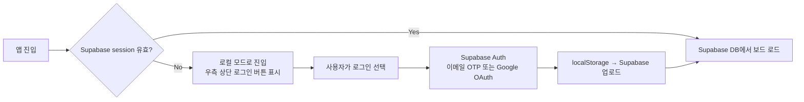

# MindCanvas — 지식 캔버스 앱 웹 개발 설계서

> **버전**: v1.1  
> **변경 내역**: 다크/라이트 테마 토글 · 모바일 퍼스트 · Supabase 동기화 설계 · 터치 커넥션 · 모듈 삭제/복사/색상/확장  
> **기술 스택**: Next.js 15 (App Router) · TweakCN · Supabase (v2.0)  
> **에이전트 구조**: 서브에이전트 3종 분리  

---

## 1. 프로젝트 컨텍스트

### 목적

카테고리별로 메모·일정·이미지·링크를 **시각적 캔버스** 위에 자유롭게 배치하고, 모듈 간에 연결선을 그어 관계를 표현하는 개인용 지식 관리 도구.

Notion처럼 텍스트 중심이 아닌, **Miro/FigJam처럼 공간감 있는 2D 캔버스** 위에서 생각을 펼치고 연결하는 경험을 제공한다. **모바일이 주 플랫폼**이며, 데스크탑과의 동기화를 통해 모든 기기에서 일관된 경험을 제공한다.

### 대상 사용자

- **1차 타겟**: 스마트폰으로 이동 중에도 아이디어를 빠르게 캡처하고, PC에서 정리하는 개인 사용자 (학생, 기획자, 연구자)
- **사용 패턴**: 모바일에서 메모 추가·간단한 연결, PC에서 전체 구조 정리

### 핵심 기능 요약

| 기능 | 설명 | v1.0 | v2.0 |
|------|------|------|------|
| 카테고리(보드) 관리 | 하단 탭(모바일) / 좌측 사이드바(PC)에서 보드 목록 관리 | ✅ | ✅ |
| 무한 캔버스 | 핀치줌·팬 가능한 2D 캔버스 | ✅ | ✅ |
| 모듈 배치 | 4종 모듈(메모/일정/이미지/링크) 배치 | ✅ | ✅ |
| 모듈 연결 (터치) | 출력 앵커 탭 → 입력 앵커 탭으로 연결 생성 | ✅ | ✅ |
| 모듈 삭제 | 롱프레스(모바일) / 우클릭(PC) 컨텍스트 메뉴로 삭제 | ✅ | ✅ |
| 모듈 복사 | 컨텍스트 메뉴에서 복사 후 캔버스에 붙여넣기 | ✅ | ✅ |
| 모듈 색상 변경 | 모듈별 독립 색상 팔레트 (라이트/다크 각 8색) | ✅ | ✅ |
| 모듈 미리보기/확장 | 기본 접힌(collapsed) 상태, 탭으로 펼침 | ✅ | ✅ |
| 다크/라이트 테마 | 시스템 설정 감지 + 수동 토글 | ✅ | ✅ |
| 로컬 퍼시스턴스 | localStorage 기반 저장 | ✅ | ✅ (fallback) |
| 계정 동기화 | Supabase Auth + DB 다기기 동기화 | ❌ | ✅ |
| 실시간 동기화 | Supabase Realtime | ❌ | ✅ |

### 제약조건

- **v1.0 인증 없음**: 완전 로컬 (localStorage)
- **모바일 퍼스트**: 터치 인터랙션이 1순위, 마우스는 2순위
- **터치 커넥션**: 마우스 드래그 없이 탭 2회(출력→입력)로 연결
- **Next.js 15 App Router** 사용
- **성능**: 모듈 100개 이상에서도 60fps 유지

### 용어 정의

| 용어 | 정의 |
|------|------|
| **보드(Board)** | 하나의 카테고리에 대응하는 캔버스 공간 |
| **모듈(Module)** | 캔버스 위에 배치되는 개별 카드 |
| **커넥션(Connection)** | 두 모듈을 연결하는 화살표 선 |
| **출력 앵커(Output Anchor)** | 커넥션을 시작하는 포인트 (모듈 우측/하단) |
| **입력 앵커(Input Anchor)** | 커넥션을 받는 포인트 (모듈 좌측/상단) |
| **collapsed 상태** | 모듈의 제목+요약만 표시된 접힌 상태 |
| **expanded 상태** | 모듈의 전체 내용이 표시된 펼친 상태 |

---

## 2. 페이지 목록 및 사용자 흐름

### 페이지 목록

| 경로 | 페이지명 | 설명 | 인증 필요 |
|------|--------|------|---------|
| `/` | 앱 메인 | 캔버스 통합 레이아웃 (SPA) | 불필요 |
| `/` (보드 미선택) | 온보딩 상태 | 첫 방문 시 보드 생성 유도 | 불필요 |

> **단일 페이지 앱(SPA)**: 라우팅 없이 상태(선택된 보드)에 따라 캔버스 내용 교체

### 사용자 흐름 다이어그램

```mermaid
flowchart TD
    A[앱 최초 접속] --> B{localStorage에\n보드 데이터 있음?}
    B -- 없음 --> C[온보딩: 첫 보드 생성 유도]
    B -- 있음 --> D[마지막 보드 복원]

    C --> E[보드 이름 입력 → 보드 생성]
    E --> D

    D --> F[보드 선택\n모바일: 하단 탭 / PC: 좌측 사이드바]
    F --> G[캔버스 로드]

    G --> H{사용자 액션}

    H -- 모듈 추가 --> I[하단 FAB 버튼 탭 → 모듈 타입 선택]
    I --> J[캔버스 중앙에 모듈 배치]
    J --> K[collapsed 상태로 생성]

    H -- 모듈 탭 --> L{현재 상태?}
    L -- collapsed --> M[expanded 상태로 전환 — 전체 내용 표시]
    L -- expanded --> N[collapsed 상태로 복귀]

    H -- 모듈 내용 편집 --> O[expanded 상태에서 인라인 편집]
    O --> P[자동 저장 debounce 500ms]

    H -- 커넥션 생성 --> Q[출력 앵커 탭 → 연결 대기 상태]
    Q --> R[다른 모듈의 입력 앵커 탭]
    R --> S[커넥션 생성]
    S --> P

    H -- 모듈 컨텍스트 메뉴 --> T[롱프레스(모바일) / 우클릭(PC)]
    T --> U{메뉴 선택}
    U -- 색상 변경 --> V[색상 팔레트 선택 → 즉시 반영]
    U -- 복사 --> W[모듈 복사본 생성\n원본에서 약간 오프셋]
    U -- 삭제 --> X[확인 다이얼로그 → 삭제\n연결된 커넥션도 함께 삭제]

    H -- 캔버스 탐색 --> Y[핀치줌(모바일) / 스크롤줌(PC)\n1손가락 팬(모바일) / 스페이스+드래그(PC)]

    H -- 테마 토글 --> Z[다크/라이트 전환 — 즉시 반영]
```

### 모바일 커넥션 흐름 (터치 전용)

```
1. 모듈 A를 탭하여 selected 상태로 진입
   → 모듈 테두리에 출력 앵커(●) 표시
2. 출력 앵커 탭
   → "연결 대기" 모드 진입 (점선 프리뷰 선 표시)
   → 다른 모든 모듈에 입력 앵커(○) 표시
3. 모듈 B의 입력 앵커 탭
   → A→B 커넥션 생성
   → 연결 대기 모드 종료
4. 빈 캔버스 탭
   → 연결 대기 모드 취소
```

---

## 3. 데이터 모델

### v1.0: localStorage 기반

```typescript
// localStorage key: "mindcanvas_v1"
interface AppData {
  version: number;                    // 스키마 버전 (마이그레이션용)
  theme: "light" | "dark" | "system";
  boards: Board[];
  lastOpenedBoardId: string | null;
}

interface Board {
  id: string;                         // UUID
  name: string;
  icon: string;                       // 이모지 (예: "📚")
  color: string;                      // 사이드바 accent 색상 hex
  createdAt: string;                  // ISO
  updatedAt: string;                  // ISO (동기화 conflict 해결용)
  modules: Module[];
  connections: Connection[];
  viewport: { x: number; y: number; zoom: number };
}

type ModuleType = "memo" | "schedule" | "image" | "link";

interface Module {
  id: string;
  type: ModuleType;
  position: { x: number; y: number };
  size: { width: number; height: number };
  zIndex: number;
  color: ModuleColor;                 // 모듈 개별 색상
  isExpanded: boolean;                // collapsed/expanded 상태
  createdAt: string;
  updatedAt: string;
  data: MemoData | ScheduleData | ImageData | LinkData;
}

// 모듈 색상 팔레트 — 라이트/다크 각 8색
type ModuleColor =
  | "default"   // 라이트: #FFFFFF, 다크: #2A2A2A
  | "yellow"    // 라이트: #FEF9C3, 다크: #3D3200
  | "pink"      // 라이트: #FCE7F3, 다크: #3D0A2A
  | "blue"      // 라이트: #DBEAFE, 다크: #0D2340
  | "green"     // 라이트: #DCFCE7, 다크: #0D2A1A
  | "purple"    // 라이트: #F3E8FF, 다크: #2A1040
  | "orange"    // 라이트: #FFEDD5, 다크: #3D1A00
  | "teal";     // 라이트: #CCFBF1, 다크: #003D33

interface MemoData {
  title: string;
  content: string;                    // 마크다운
  previewLines: number;               // collapsed 시 표시 줄 수 (기본 2)
}

interface ScheduleData {
  title: string;
  items: ScheduleItem[];
  previewCount: number;               // collapsed 시 표시 항목 수 (기본 3)
}

interface ScheduleItem {
  id: string;
  text: string;
  dueDate: string | null;
  done: boolean;
}

interface ImageData {
  title: string;
  src: string;                        // base64
  caption: string;
}

interface LinkData {
  url: string;
  title: string;
  description: string;
  favicon: string;
  thumbnail: string;
}

interface Connection {
  id: string;
  fromModuleId: string;
  toModuleId: string;
  fromAnchor: "top" | "right" | "bottom" | "left";
  toAnchor: "top" | "right" | "bottom" | "left";
  label: string;
  style: "solid" | "dashed";
  color: string;
}
```

---

## 4. Supabase 동기화 설계 (v2.0 로드맵)

> v1.0에서는 localStorage만 사용. 단, 타입 구조를 Supabase 스키마와 1:1 대응하도록 설계하여 마이그레이션 비용을 최소화한다.

### 4.1 Supabase 테이블 스키마

| 테이블명 | 설명 | RLS | 실시간 구독 |
|---------|------|-----|-----------|
| `mc_users` | 사용자 프로필 (auth.uid 기반) | ✅ | ❌ |
| `mc_boards` | 보드 목록 | ✅ user_id | ✅ |
| `mc_modules` | 보드별 모듈 | ✅ board 소유자 | ✅ |
| `mc_connections` | 모듈 간 커넥션 | ✅ board 소유자 | ✅ |

```sql
-- mc_boards
CREATE TABLE mc_boards (
  id          UUID PRIMARY KEY DEFAULT gen_random_uuid(),
  user_id     UUID REFERENCES auth.users NOT NULL,
  name        TEXT NOT NULL,
  icon        TEXT DEFAULT '📋',
  color       TEXT DEFAULT '#6366F1',
  viewport    JSONB DEFAULT '{"x":0,"y":0,"zoom":1}',
  created_at  TIMESTAMPTZ DEFAULT NOW(),
  updated_at  TIMESTAMPTZ DEFAULT NOW()
);

-- mc_modules
CREATE TABLE mc_modules (
  id          UUID PRIMARY KEY DEFAULT gen_random_uuid(),
  board_id    UUID REFERENCES mc_boards ON DELETE CASCADE NOT NULL,
  type        TEXT CHECK (type IN ('memo','schedule','image','link')) NOT NULL,
  position    JSONB NOT NULL,           -- {x, y}
  size        JSONB NOT NULL,           -- {width, height}
  z_index     INT DEFAULT 0,
  color       TEXT DEFAULT 'default',
  is_expanded BOOLEAN DEFAULT FALSE,
  data        JSONB NOT NULL,
  created_at  TIMESTAMPTZ DEFAULT NOW(),
  updated_at  TIMESTAMPTZ DEFAULT NOW()
);

-- mc_connections
CREATE TABLE mc_connections (
  id              UUID PRIMARY KEY DEFAULT gen_random_uuid(),
  board_id        UUID REFERENCES mc_boards ON DELETE CASCADE NOT NULL,
  from_module_id  UUID REFERENCES mc_modules ON DELETE CASCADE NOT NULL,
  to_module_id    UUID REFERENCES mc_modules ON DELETE CASCADE NOT NULL,
  from_anchor     TEXT CHECK (from_anchor IN ('top','right','bottom','left')) NOT NULL,
  to_anchor       TEXT CHECK (to_anchor IN ('top','right','bottom','left')) NOT NULL,
  label           TEXT DEFAULT '',
  style           TEXT DEFAULT 'solid',
  color           TEXT DEFAULT '#6366F1',
  created_at      TIMESTAMPTZ DEFAULT NOW()
);
```

### 4.2 동기화 전략

```
v1.0 localStorage 전용
  ↓
v2.0 전환 시:
  로그인 전  → localStorage 유지
  최초 로그인 → localStorage 데이터 Supabase에 업로드 (one-time migration)
  이후       → Supabase Primary + localStorage 캐시(오프라인 fallback)
```

**Conflict 해결 정책**: `updated_at` 최신 값 우선 (Last-Write-Wins)  
**오프라인 지원**: 오프라인 중 변경분은 localStorage에 누적 → 재연결 시 자동 업로드

### 4.3 인증 흐름 (v2.0)



### 4.4 v2.0 환경 변수 추가 목록

| 변수명 | 용도 |
|--------|------|
| `NEXT_PUBLIC_SUPABASE_URL` | Supabase 프로젝트 URL |
| `NEXT_PUBLIC_SUPABASE_ANON_KEY` | Supabase 공개 키 |
| `SUPABASE_SERVICE_ROLE_KEY` | 서버사이드 Admin 작업용 |

---

## 5. UI/UX 방향

### 5.1 다크/라이트 테마 시스템

테마는 CSS 변수(`data-theme` attribute) 기반으로 런타임 전환. 시스템 설정 자동 감지 + 수동 토글.

```css
/* globals.css — 라이트 테마 (기본) */
:root, [data-theme="light"] {
  --background: #F8F7F4;
  --canvas-grid: #E0DED8;
  --surface: #FFFFFF;
  --surface-hover: #F4F3F0;
  --surface-elevated: #FFFFFF;
  --border: #E4E2DC;
  --border-strong: #CCCAC4;
  --primary: #6366F1;
  --primary-soft: #EEF2FF;
  --primary-fg: #FFFFFF;
  --accent: #F59E0B;
  --text-primary: #1C1B18;
  --text-secondary: #6B6860;
  --text-muted: #A8A39A;
  --shadow-sm: 0 1px 3px rgba(0,0,0,0.08);
  --shadow-md: 0 4px 12px rgba(0,0,0,0.10);
  --shadow-lg: 0 8px 24px rgba(0,0,0,0.12);
  --connection-default: #6366F1;

  /* 모듈 색상 팔레트 — 라이트 */
  --module-default: #FFFFFF;
  --module-yellow:  #FEF9C3;
  --module-pink:    #FCE7F3;
  --module-blue:    #DBEAFE;
  --module-green:   #DCFCE7;
  --module-purple:  #F3E8FF;
  --module-orange:  #FFEDD5;
  --module-teal:    #CCFBF1;
}

/* 다크 테마 */
[data-theme="dark"] {
  --background: #111110;
  --canvas-grid: #252422;
  --surface: #1C1C1A;
  --surface-hover: #242422;
  --surface-elevated: #2A2A28;
  --border: #2E2E2C;
  --border-strong: #3E3E3C;
  --primary: #818CF8;
  --primary-soft: #1E1F3A;
  --primary-fg: #FFFFFF;
  --accent: #FCD34D;
  --text-primary: #EDEDEB;
  --text-secondary: #9B9A96;
  --text-muted: #6B6A66;
  --shadow-sm: 0 1px 3px rgba(0,0,0,0.4);
  --shadow-md: 0 4px 12px rgba(0,0,0,0.5);
  --shadow-lg: 0 8px 24px rgba(0,0,0,0.6);
  --connection-default: #818CF8;

  /* 모듈 색상 팔레트 — 다크 */
  --module-default: #2A2A28;
  --module-yellow:  #3D3200;
  --module-pink:    #3D0A2A;
  --module-blue:    #0D2340;
  --module-green:   #0D2A1A;
  --module-purple:  #2A1040;
  --module-orange:  #3D1A00;
  --module-teal:    #003D33;
}
```

**테마 토글 위치**: 모바일 — 상단 헤더 우측 아이콘 / PC — 사이드바 하단 아이콘

### 5.2 레이아웃 구조

#### 모바일 레이아웃 (< 768px) — 주 플랫폼

```
┌────────────────────────────────┐
│ [≡ 보드명]         [🌙] [+모듈] │  ← 상단 헤더 (56px)
├────────────────────────────────┤
│                                │
│   ·  ·  ·  ·  ·  ·  ·  ·  ·  │
│   ·  ┌──────────────────┐  ·  │
│   ·  │ 📝 회의 요약       │  ·  │  ← collapsed 모듈
│   ·  │ 오늘 회의에서...   │  ·  │    (제목+2줄 미리보기)
│   ·  └──────────────────┘  ·  │
│   ·      ↓ 커넥션 선         ·  │
│   ·  ┌──────────────────┐  ·  │
│   ·  │ ✅ 액션 아이템     │  ·  │
│   ·  │ □ 보고서 작성      │  ·  │
│   ·  └──────────────────┘  ·  │
│                                │
├────────────────────────────────┤
│ [📋보드1] [💼보드2] [📚보드3] [+] │  ← 하단 탭 바 (60px)
└────────────────────────────────┘

※ 하단 우측 FAB: 모듈 추가
※ 하단 좌측: 줌 컨트롤 (±)
```

#### 태블릿 레이아웃 (768px ~ 1023px)

```
┌──────────┬─────────────────────────┐
│ [아이콘만]│      캔버스 영역          │
│  사이드바 │                         │
│  (64px)  │  전체 편집 가능           │
│          │                         │
│ 📋       │   [FAB] [줌컨트롤]        │
│ 💼       │                         │
│ 📚       │                         │
│ ─────    │                         │
│ 🌙       │                         │
└──────────┴─────────────────────────┘
```

#### 데스크탑 레이아웃 (≥ 1024px)

```
┌──────────────┬──────────────────────────────────┐
│ 사이드바 240px│         캔버스 영역                │
│              │                                  │
│ 🧠 MindCanvas│  ·  ·  ·  ·  ·  ·  ·  ·  ·  ·  │
│ ──────────   │                                  │
│ + 새 보드    │  ┌────────────┐  ┌────────────┐  │
│              │  │ 메모 카드   │→→│ 일정 카드   │  │
│ 📋 대학수업 ● │  └────────────┘  └────────────┘  │
│ 💼 업무      │                                  │
│ 📅 개인일정  │                                  │
│ 🤖 클로드    │                                  │
│              │      [모듈 툴바]   [줌 컨트롤]     │
│ ──────────   │                                  │
│ 🌙 다크모드   │                                  │
└──────────────┴──────────────────────────────────┘
```

### 5.3 모듈 카드 UI 명세

#### Collapsed 상태 (기본)

```
┌─────────────────────────────────────┐
│ [🟣 아이콘] 제목                  [⋮] │  ← 헤더 (44px 터치 타겟)
│ 미리보기 텍스트 첫 2줄만 표시됩니다.  │  ← 미리보기 영역
│ 더 많은 내용...                       │
│                          [↕ 더보기] │  ← 탭하면 expanded
├──[●]────────────────────────────[○]─┤  ← 앵커 (출력●, 입력○)
└─────────────────────────────────────┘
```

#### Expanded 상태

```
┌─────────────────────────────────────┐
│ [🟣 아이콘] 제목                  [⋮] │  ← 헤더
│                          [↑ 접기]   │
├─────────────────────────────────────┤
│                                     │
│  전체 내용이 여기에 표시됩니다.        │
│  마크다운 렌더링 / 할일 목록 / 이미지 │
│  (스크롤 가능)                       │
│                                     │
├──[●]────────────────────────────[○]─┤
└─────────────────────────────────────┘
```

#### 앵커 포인트 배치 규칙

- **출력 앵커(●)**: 기본은 모듈 하단 중앙 / PC에서는 우측 중앙도 지원
- **입력 앵커(○)**: 기본은 모듈 상단 중앙 / PC에서는 좌측 중앙도 지원
- **터치 타겟**: 최소 44×44px (Apple HIG 기준)
- **연결 대기 상태**: 출력 앵커 탭 후 → 앵커가 pulse 애니메이션으로 강조, 입력 앵커가 모든 다른 모듈에 표시

#### 컨텍스트 메뉴 항목

```
롱프레스(모바일) / 우클릭(PC) →

┌─────────────────────┐
│ 🎨 색상 변경          │  → 8색 팔레트 선택 시트
│ 📋 복사              │  → 현재 위치에서 +20px 오프셋으로 복사
│ 🗑 삭제              │  → "이 모듈을 삭제할까요?" 확인 다이얼로그
│     (커넥션도 함께 삭제) │
└─────────────────────┘
```

#### 색상 팔레트 선택 시트 (모바일: 바텀시트)

```
┌─────────────────────────────────┐
│ 모듈 색상 선택                    │
│                                 │
│  ⬜ ⬛ 🟡 🟣 🔵 🟢 🟠 🩵        │
│ (default) (dark) 노랑 보라 파랑 초록 주황 틸 │
│                                 │
│              [취소]              │
└─────────────────────────────────┘
```

### 5.4 반응형 브레이크포인트 전략

| 브레이크포인트 | 레이아웃 | 커넥션 방식 | 사이드바 |
|--------------|---------|-----------|---------|
| `< 768px` (mobile) | 하단 탭 + 상단 헤더 | 탭 2회 (출력→입력) | 없음 (탭 바 대체) |
| `768px ~ 1023px` (tablet) | 아이콘 사이드바 64px | 탭 또는 드래그 | 아이콘만 |
| `≥ 1024px` (desktop) | 사이드바 240px | 앵커 드래그 or 탭 | 풀 사이드바 |

### 5.5 핵심 컴포넌트 목록

| 컴포넌트 | 역할 | 모바일 특이사항 |
|---------|------|--------------|
| `TopHeader` | 보드명, 테마 토글, 모듈 추가 버튼 | 모바일 전용 |
| `Sidebar` | 보드 목록, 보드 생성/삭제, 테마 토글 | PC 전용 |
| `BottomTabBar` | 보드 탭 전환 | 모바일 전용 |
| `Canvas` | 핀치줌·팬 가능한 무한 캔버스 | 터치 제스처 우선 |
| `CanvasGrid` | 도트 그리드 SVG 배경 | - |
| `ModuleCard` | 공통 외피 (드래그, 선택, collapsed/expanded) | 롱프레스 컨텍스트 메뉴 |
| `MemoModule` | 자유 텍스트 메모 | - |
| `ScheduleModule` | 할일 목록 | - |
| `ImageModule` | 이미지 업로드·미리보기 | 카메라/갤러리 접근 |
| `LinkModule` | URL → OG 메타 카드 | - |
| `ConnectionLayer` | SVG 베지어 커넥션 레이어 | - |
| `AnchorPoint` | 출력(●)/입력(○) 앵커 | 44px 터치 타겟 |
| `ConnectionPreview` | 연결 대기 중 프리뷰 선 | 손가락 위치 추적 |
| `ModuleFAB` | 모듈 추가 플로팅 버튼 | 모바일 주요 진입점 |
| `ModuleContextMenu` | 색상/복사/삭제 메뉴 | 모바일: 바텀시트 |
| `ColorPalette` | 8색 모듈 색상 선택 | 모바일: 바텀시트 |
| `ZoomControls` | +/- 줌 버튼, 전체보기 | 좌측 하단 배치 |
| `ThemeToggle` | 다크/라이트 전환 | 헤더/사이드바 |
| `DeleteConfirmDialog` | 삭제 확인 다이얼로그 | - |

### 5.6 TweakCN 커스터마이징 대상

| 컴포넌트 | 변경 방향 |
|---------|----------|
| `Button` | 라운딩 `rounded-xl`, 터치 타겟 최소 44px |
| `Card` | CSS 변수 기반 색상(`--module-*`), `shadow-md` |
| `Input` | 배경 `var(--surface)`, focus ring primary 색상 |
| `Sheet` (바텀시트) | 모바일 컨텍스트 메뉴·색상 팔레트 전용 |
| `Dialog` | 삭제 확인, 보드 생성 다이얼로그 |
| `Tabs` | 하단 탭 바 (모바일 보드 전환) |
| `Tooltip` | `var(--surface-elevated)` + border |

### 5.7 애니메이션·인터랙션 방향

- **모듈 추가**: `scale(0.85→1.0)` + `fadeIn` 200ms ease-out
- **보드 전환**: 캔버스 `opacity(1→0→1)` 150ms
- **테마 전환**: CSS `transition: background-color 200ms, color 200ms` 전역 적용
- **Expanded 전환**: 카드 높이 `height` 애니메이션 250ms ease-in-out
- **앵커 연결 대기**: `pulse` 애니메이션 + 리플 효과
- **커넥션 프리뷰**: SVG 점선(`stroke-dasharray`) + 손가락/커서 추적
- **모듈 드래그**: `scale(1.03)` + `shadow-lg` 강화 + `cursor-grabbing`
- **컨텍스트 메뉴**: 모바일 바텀시트 슬라이드업 300ms

---

## 6. 구현 스펙

### 폴더 구조

```
/mindcanvas
  ├── CLAUDE.md
  ├── .claude/
  │   ├── agents/
  │   │   ├── ui-builder/AGENT.md
  │   │   ├── canvas-engine/AGENT.md
  │   │   └── data-layer/AGENT.md
  │   └── skills/
  │       ├── og-fetcher/
  │       │   ├── SKILL.md
  │       │   └── scripts/fetch-og.ts
  │       └── local-storage/
  │           ├── SKILL.md
  │           └── scripts/storage.ts
  ├── app/
  │   ├── layout.tsx                    # ThemeProvider, 폰트, 전역 CSS
  │   ├── page.tsx                      # SPA 진입점
  │   └── api/og/route.ts               # OG 메타 서버사이드 fetch
  ├── components/
  │   ├── ui/                           # TweakCN 컴포넌트
  │   ├── layout/
  │   │   ├── TopHeader.tsx             # 모바일 헤더
  │   │   ├── Sidebar.tsx               # PC 사이드바
  │   │   └── BottomTabBar.tsx          # 모바일 하단 탭
  │   ├── canvas/
  │   │   ├── Canvas.tsx                # 핀치줌·팬 컨테이너
  │   │   ├── CanvasGrid.tsx
  │   │   ├── ConnectionLayer.tsx       # SVG 커넥션
  │   │   ├── ConnectionPreview.tsx     # 연결 대기 프리뷰
  │   │   ├── AnchorPoint.tsx
  │   │   └── ZoomControls.tsx
  │   ├── modules/
  │   │   ├── ModuleCard.tsx            # 공통 외피 (collapsed/expanded)
  │   │   ├── MemoModule.tsx
  │   │   ├── ScheduleModule.tsx
  │   │   ├── ImageModule.tsx
  │   │   └── LinkModule.tsx
  │   └── ui-overlays/
  │       ├── ModuleFAB.tsx             # 모듈 추가 FAB
  │       ├── ModuleContextMenu.tsx     # 색상/복사/삭제
  │       ├── ColorPalette.tsx          # 8색 팔레트
  │       ├── DeleteConfirmDialog.tsx
  │       └── ThemeToggle.tsx
  ├── lib/
  │   ├── storage/
  │   │   ├── index.ts                  # localStorage 읽기/쓰기
  │   │   └── migrations.ts             # 스키마 버전 마이그레이션
  │   ├── canvas/
  │   │   ├── geometry.ts               # 좌표·앵커 계산
  │   │   ├── bezier.ts                 # SVG 경로 생성
  │   │   └── touch.ts                  # 터치 제스처 유틸
  │   └── og/fetcher.ts
  ├── store/
  │   ├── canvas.ts                     # 보드·모듈·커넥션·뷰포트 상태
  │   ├── connection.ts                 # 커넥션 대기 상태 전용
  │   └── theme.ts                      # 테마 상태
  ├── hooks/
  │   ├── usePinchZoom.ts               # 핀치줌 제스처
  │   ├── useLongPress.ts               # 롱프레스 감지
  │   ├── useConnectionMode.ts          # 커넥션 대기 모드 상태
  │   └── useTheme.ts                   # 테마 로직
  ├── types/index.ts
  ├── output/
  └── docs/references/
      ├── canvas-engine-guide.md
      └── supabase-migration-guide.md   # v2.0 마이그레이션 가이드 초안
```

### 에이전트 구조

```
CLAUDE.md (오케스트레이터)
  ├── ui-builder      → 컴포넌트·테마·모바일 레이아웃 구현
  ├── canvas-engine   → 핀치줌·터치 커넥션·SVG·Zustand 로직
  └── data-layer      → localStorage·타입·OG API
```

#### 서브에이전트 상세

| 서브에이전트 | 역할 | 트리거 조건 | 주요 산출물 |
|-------------|------|-----------|-----------|
| `ui-builder` | TweakCN 커스터마이징, 모듈 카드 UI (collapsed/expanded), 바텀시트, 색상 팔레트, 테마 토글 | 컴포넌트 구현·수정 시 | `components/**/*.tsx` |
| `canvas-engine` | 핀치줌, 팬, 터치 커넥션 2탭 모드, SVG 커넥션, Zustand 스토어, 모듈 복사/삭제 로직 | 캔버스 동작 구현 시 | `Canvas.tsx`, `store/*`, `lib/canvas/*`, `hooks/*` |
| `data-layer` | localStorage 스키마, 버전 마이그레이션, OG fetch API, v2.0 Supabase 스키마 초안 | 데이터 구조 변경 시 | `lib/storage/*`, `api/og/*`, `types/index.ts` |

### 스킬 목록

| 스킬명 | 역할 | 트리거 조건 |
|-------|------|-----------|
| `og-fetcher` | URL OG 메타 서버사이드 fetch | LinkModule URL 입력 시 |
| `local-storage` | localStorage 읽기/쓰기, 자동저장 debounce, 스키마 버전 관리 | 모든 상태 변경 후 |

### 주요 라이브러리

| 라이브러리 | 용도 |
|----------|------|
| `zustand` | 전역 상태 관리 |
| `@dnd-kit/core` | 모듈 드래그 (PC·태블릿) |
| `react-markdown` | 메모 마크다운 렌더링 |
| `date-fns` | 날짜 포매팅 |
| `uuid` | ID 생성 |
| `next-themes` | 다크/라이트 테마 + 시스템 설정 감지 |

### 환경 변수

| 변수명 | 용도 | v1.0 | v2.0 |
|--------|------|------|------|
| `NEXT_PUBLIC_APP_URL` | OG fetch API 절대 경로 | ✅ | ✅ |
| `NEXT_PUBLIC_SUPABASE_URL` | Supabase 프로젝트 URL | ❌ | ✅ |
| `NEXT_PUBLIC_SUPABASE_ANON_KEY` | Supabase 공개 키 | ❌ | ✅ |
| `SUPABASE_SERVICE_ROLE_KEY` | 서버사이드 Admin | ❌ | ✅ |

---

## 7. 워크플로우 상세 정의

### 데이터 흐름

```
사용자 액션
  → Zustand store 업데이트
  → React 리렌더링
  → debounce(500ms) → localStorage 자동 저장
  
v2.0 추가:
  → 로그인 상태 시: Supabase Realtime 푸시
  → 다른 기기에서 Realtime 수신 → store 업데이트
```

### 커넥션 생성 상태 머신

```
IDLE
  → [출력 앵커 탭] → CONNECTING (fromModuleId, fromAnchor 저장)
  
CONNECTING
  → [입력 앵커 탭] → IDLE + 커넥션 생성
  → [빈 캔버스 탭] → IDLE (취소)
  → [ESC 키] → IDLE (취소)
  → [같은 모듈 탭] → IDLE (자기 자신 연결 방지)
```

### LLM 판단 vs 코드 처리

| LLM(에이전트)가 결정 | 코드가 처리 |
|--------------------|-----------|
| 모바일 터치 UX 패턴 설계 | 핀치줌 행렬 계산 |
| 앵커 위치·크기 UX 판단 | 베지어 커브 SVG 경로 |
| 바텀시트 vs 팝오버 선택 | localStorage 직렬화 |
| 테마 색상 토큰 조합 | 터치 좌표 → 캔버스 좌표 변환 |
| collapsed 미리보기 줄 수 | 모듈 복사 딥클론 로직 |

### 성공 기준 및 검증

| 단계 | 성공 기준 | 검증 방법 | 실패 처리 |
|-----|---------|---------|---------|
| 타입 정의 | TypeScript 오류 0개 | `tsc --noEmit` | 자동 재시도 |
| 테마 전환 | 전환 시 깜빡임 없음, CSS 변수 100% 적용 | 시각적 확인 | 자동 재시도 |
| 핀치줌 | 60fps, 정확한 focal point 유지 | Performance 탭 | 에스컬레이션 |
| 터치 커넥션 | 탭 2회로 커넥션 생성 완료 | 기기 실제 테스트 | 에스컬레이션 |
| 모듈 삭제 | 모듈+연결 커넥션 동시 삭제 | 규칙 기반 | 자동 재시도 |
| 모듈 복사 | 원본과 동일 내용, 오프셋 위치 | 시각적 확인 | 자동 재시도 |
| Collapsed/Expanded | 탭으로 전환, 높이 애니메이션 | 시각적 확인 | 폴백 (애니메이션 제거) |
| 모바일 레이아웃 | Lighthouse Mobile ≥ 88 | Lighthouse | 에스컬레이션 |
| localStorage 복원 | 새로고침 후 상태 100% 일치 | 규칙 기반 | 자동 재시도 |

---

## 8. 구현 순서 (빌드 시퀀스)

### Phase 1 — 기반 (data-layer)
1. 타입 정의 (`types/index.ts`) — `ModuleColor`, `isExpanded`, `updatedAt` 포함
2. localStorage 스킬 + 버전 마이그레이션
3. Zustand 스토어 초기화 (보드·모듈·커넥션·테마·커넥션 대기)
4. **검증**: `tsc --noEmit` 오류 0개

### Phase 2 — 테마 + 레이아웃 (ui-builder)
5. `next-themes` 설정, CSS 변수 전체 정의
6. 모바일 레이아웃 (`TopHeader`, `BottomTabBar`)
7. PC 레이아웃 (`Sidebar`)
8. 온보딩 화면
9. **검증**: 라이트/다크 전환 확인, 모바일/PC 레이아웃 확인

### Phase 3 — 캔버스 엔진 (canvas-engine)
10. `Canvas.tsx` — 핀치줌·팬 (모바일 터치 우선)
11. `CanvasGrid.tsx`
12. `ModuleCard.tsx` — collapsed/expanded, 드래그, 롱프레스
13. **검증**: 60fps 드래그·줌, 탭으로 expanded 전환

### Phase 4 — 모듈 구현 (ui-builder)
14. `MemoModule`, `ScheduleModule`, `ImageModule`, `LinkModule`
15. `ColorPalette`, `ModuleContextMenu` (색상·복사·삭제)
16. `DeleteConfirmDialog`
17. `ModuleFAB`
18. **검증**: 4종 모듈 + 색상 변경 + 삭제/복사 동작 확인

### Phase 5 — 커넥션 시스템 (canvas-engine)
19. `AnchorPoint` — 출력/입력 앵커 (44px 터치 타겟)
20. `useConnectionMode` — 2탭 커넥션 상태 머신
21. `ConnectionPreview` — 연결 대기 프리뷰 선
22. `ConnectionLayer` — 완성된 커넥션 SVG
23. **검증**: 모바일 기기에서 탭 2회 커넥션 생성 확인

### Phase 6 — 마무리
24. 애니메이션·마이크로인터랙션 완성
25. `docs/references/supabase-migration-guide.md` 초안 작성
26. **검증**: Lighthouse Mobile ≥ 88, 전체 흐름 사람 검토

---

## 9. v2.0 이월 기능

| 기능 | 이유 |
|------|------|
| Supabase 계정 동기화 | v1.0 로컬 검증 후 |
| 다기기 Realtime 동기화 | Supabase 연동 후 |
| 카테고리 간 모듈 이동 | UX 검증 후 |
| 보드 내보내기 (PNG) | canvas-to-image 파이프라인 별도 |
| 전문 검색 | 데이터 볼륨 증가 후 |
| 커넥션 라벨 편집 | 인터랙션 복잡도 |
| 공유 링크 (읽기 전용) | Supabase 연동 후 |
| 미니맵 | 모듈 수 증가 후 필요성 검증 |

---

## 10. 참고 자료

- **디자인 레퍼런스**: Miro (캔버스 UX), Obsidian Canvas (커넥션), FigJam (소프트 팔레트), Notion (다크/라이트)
- **모바일 터치**: Apple HIG — 최소 터치 타겟 44×44pt
- **캔버스 구현**: CSS `transform: translate(x,y) scale(z)` 기반
- **핀치줌**: `TouchEvent` `touches[0]` + `touches[1]` 거리 계산
- **테마**: `next-themes` + CSS `data-theme` attribute
- **dnd-kit**: https://docs.dndkit.com
- **Zustand**: https://zustand-demo.pmnd.rs
- **Supabase Realtime**: https://supabase.com/docs/guides/realtime
